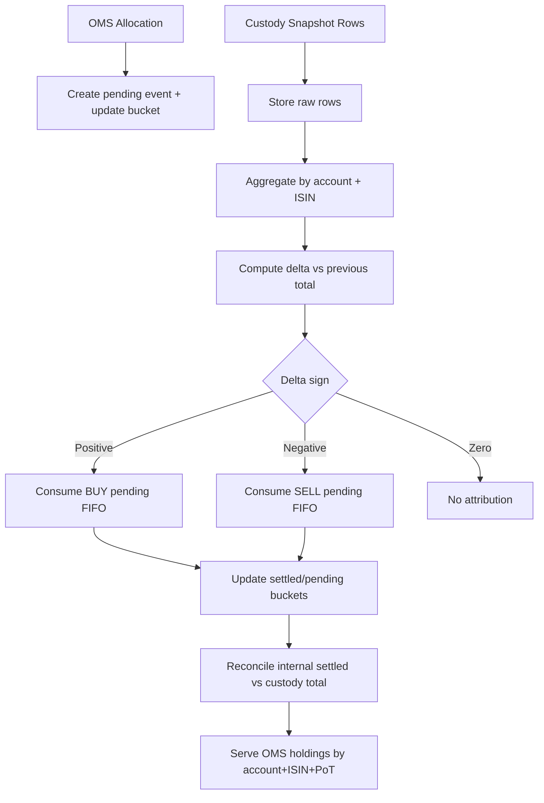
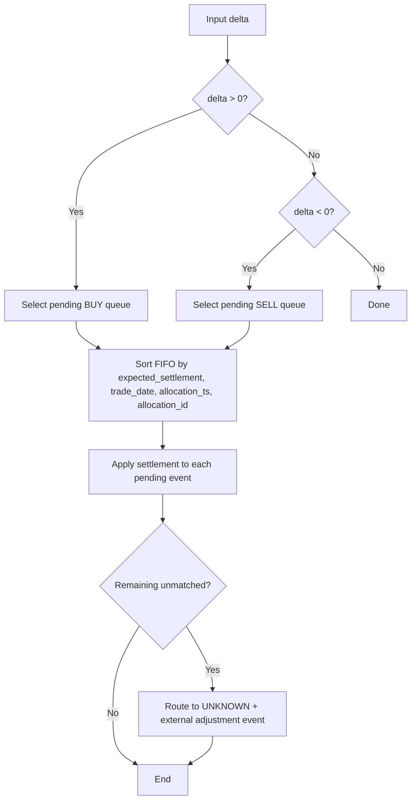
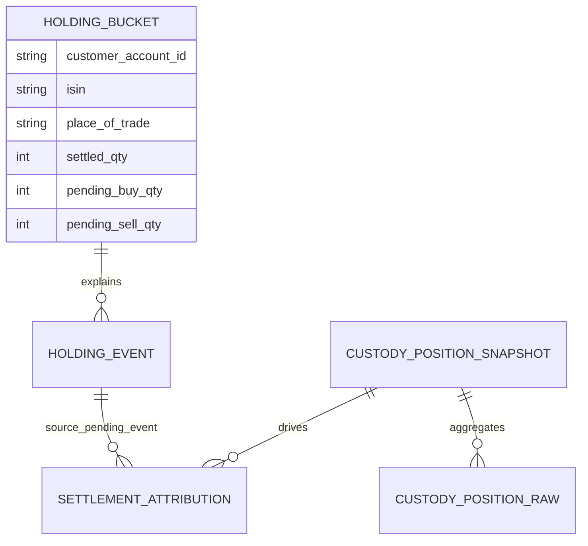
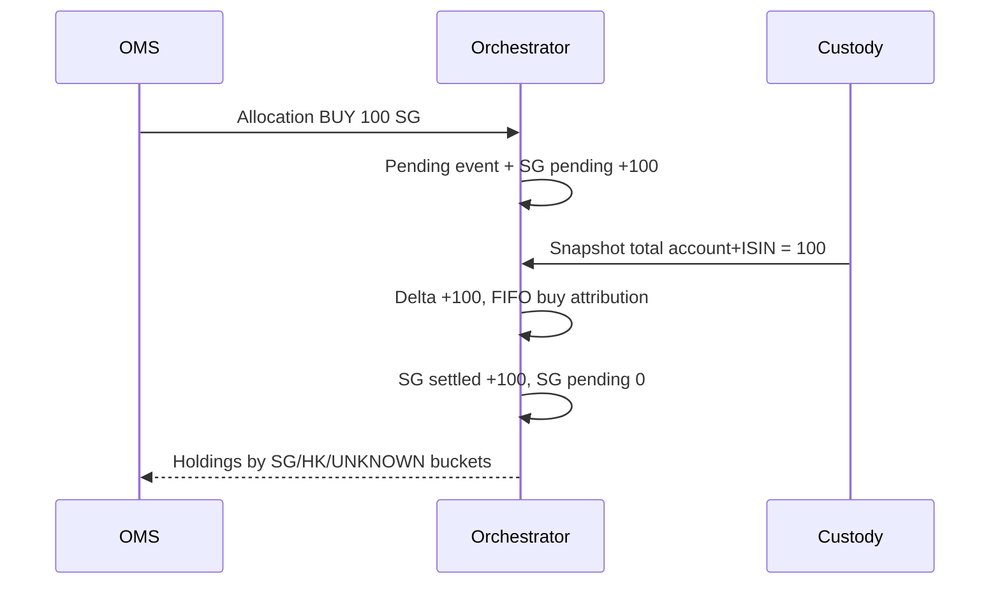

# Client Holdings Attribution Simulator

## 1) Executive summary
This project demonstrates a **holdings attribution design** for a trading orchestrator that must answer OMS holdings by **account + ISIN + place of trade**, even though custody only confirms aggregate settled quantity at **account + ISIN** level.

The simulator shows how to:
- preserve place of trade from OMS allocations,
- ingest custody snapshots as aggregate control totals,
- derive settlement movement from custody deltas,
- attribute settlement to place-of-trade buckets using FIFO,
- keep an audit ledger and reconciliation controls.

## 2) Problem statement
- OMS allocations include place of trade and are operationally required for position views.
- Custody provides settled snapshots, but the place-of-trade discriminator is not reliable.
- Multiple custody rows for one account + ISIN do **not** solve attribution unless a stable key exists.
- Therefore, the orchestrator must maintain its own attributed holdings ledger.

## 3) Key design principle
- **OMS = source of truth for place of trade.**
- **Custody = source of truth for aggregate settled quantity.**
- **Orchestrator = owner of attribution logic from aggregate settled totals to place-of-trade buckets.**

## 4) Why “pending + settled tables only” is not enough
A current-balance-only model is weak because:
- it has poor lineage (hard to explain “why this number?”),
- reconciliation is opaque,
- support investigations are slow,
- deterministic rebuilds are difficult,
- stakeholder explainability is poor.

This project uses an append-only ledger and explicit attribution records to avoid that weakness.

## 5) Solution overview
Core components:
- `HoldingBucket`: current balances per account + ISIN + place_of_trade.
- `HoldingEvent`: append-only movement ledger.
- `CustodyPositionRaw`: raw snapshot rows for audit.
- `CustodyPositionSnapshot`: aggregated custody control total per account + ISIN.
- `SettlementAttribution`: links custody delta attribution to pending OMS events.
- `ReconciliationException`: control breaks when internal settled sum != custody control total.

## 6) Data model
See `src/holdings_attribution/models.py` for complete dataclasses.

- **HoldingBucket**: settled, pending buy/sell, projected quantity.
- **HoldingEvent**: allocation pending, settlement attributed, external adjustments, custody control receipts.
- **CustodyPositionRaw**: each raw custody line retained for audit.
- **CustodyPositionSnapshot**: aggregate settled total by account + ISIN.
- **SettlementAttribution**: exact split of custody delta to a place-of-trade bucket.
- **ReconciliationException**: mismatch control with details.
- **SettlementRule**: configurable cycle days (e.g., T+2).

## 7) End-to-end process flow
1. OMS allocation ingested.
2. Expected settlement date derived from settlement rule.
3. Pending event created and bucket pending qty updated.
4. Custody rows ingested and stored raw.
5. Rows aggregated to account + ISIN control total.
6. Delta vs previous custody total computed.
7. Delta attributed FIFO:
   - positive delta consumes pending buys,
   - negative delta consumes pending sells.
8. If unmatched quantity remains, route to `UNKNOWN` and record external adjustment.
9. Reconcile internal settled sum against custody control total.
10. Serve OMS holdings query by place of trade.

## 8) Handling of T+2
Examples use T+2 for SG/HK, but settlement cycle is modeled via `SettlementRuleService` and not hardcoded globally.

## 9) Scenario walkthroughs
The tests and demo cover all required scenarios:
1. Simple buy then settlement.
2. Same ISIN with SG/HK and FIFO split.
3. Multiple custody rows aggregated (no direct SG/HK mapping).
4. Sell settlement via negative delta.
5. Mixed buy/sell pending queues; deltas apply by sign only.
6. FIFO across multiple allocations by date/time/id ordering.
7. Zero-delta snapshot creates no attribution.
8. Legacy opening holdings with no OMS history -> `UNKNOWN`.
9. External unmatched movement -> `UNKNOWN` + external adjustment event.
10. Reconciliation mismatch creates exception.
11. Partial settlement leaves residual pending.
12. Multiple snapshots over time (+100, +40, -50 style behavior).
13. T+2 expected settlement modeling via rules.
14. Event-ledger design demonstrates why balance-only is insufficient.
15. Custody ambiguity is explicit: no false precision from raw rows.

## 10) Unknown / legacy / unmatched handling
The simulator intentionally supports `UNKNOWN` place-of-trade bucket. This prevents fabricated SG/HK splits when there is no reliable evidence.

## 11) Reconciliation
For each account + ISIN:
- internal settled total = sum of settled across all place-of-trade buckets,
- custody settled total = latest aggregate control total,
- mismatch -> `ReconciliationException`.

## 12) Mermaid diagrams
### End-to-end business flow


### Settlement attribution logic


### Data model (ER)


### Optional sequence example (buy)


## 13) How to run
```bash
cd holdings
python -m pip install -e .[dev]
python -m holdings_attribution.scenarios.demo_runner
pytest
```

## 14) Talking points for stakeholders
- We preserve place of trade from OMS because that is the reliable source.
- We treat custody as settled control total truth at aggregate account + ISIN level.
- We never assume custody raw rows identify SG/HK unless custody provides a true stable discriminator.
- We reconcile internal attributed totals back to custody control totals.
- We keep an event ledger so every balance is explainable.

## 15) Limitations and future enhancements
- In-memory only; no persistent DB.
- No API layer.
- Simplified calendar logic (no holiday calendars).
- No corporate action / transfer engines.
- No lot-level accounting.
- Future: amendment/cancel compensation flows, richer controls, and persisted audit storage.
